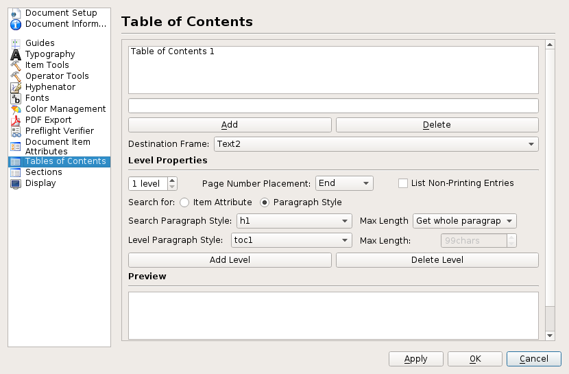

# Styles based table of contents for Scribus

Scan the document for styles named "h1", "h3", "h3" and append to the current text the titles with the page numbers and the styles "toc1", "toc2", and "toc3".

This plugin is still in its very early stages. Please read the rest of this README for understanding how it works and how it will evolve.

This plugin is heavily inspired by the `scribus/tocgenerator.cpp` created by Cezary and available in [Scribus-ece](https://github.com/AlterScribus/ece15).

## Features

Currently, the "Table of Contents" plugin just appends a table of contents to the content of the selected text frame.

The paragraphs with the styles "h1", "h2", and "h3" get collected and they are inserted with the styles "toc1", "toc2", and "toc3".

## Install

First make sure that you have the ScribusAPI plugin installed (https://github.com/aoloe/scribus-plugin-API).

Clone the `scribus-plugin-tableofcontents` repository and put – or symlink – its `src` directory into `scribus/plugins/` as `tableofcontents`. Then add 

    ADD_SUBDIRECTORY(tableofcontents)

to `CMakeList.txt` file in `scribus/plugins/`.

You will need a compiler that defaults to C++11 or enable C++11 in your `cmake` command.

## Development

We will have a Doxygen documentation of the code:

<http://impagina.org/dox/tableofcontents/>

### Ideas

Not all details on the way this plugins should work are already defined. But here is the direction we want to take:

- define each level of the TOC with a source and a target style.
  - it might be possible to set multiple source styles for each level; or define that each style that is derived from a style has to be considered.
  - a character styles should be possible for each level and
    - text
    - tab (the dots)
    - the page number
    - (eventually also the chapter number, once and if it's automotatic)
- allow collecting entries from other files.
- it is not yet defined, how the update of the table of contents work.
  - with the current model you have to delete the curent table of contents and insert a new one.
  - with the scribus-ece model (defining a target frame in the document settings) you have to know the name of the frame.
  - it could be possible to define the table of contents in the same way the page number is defined (internal special char that is rendered with its content)
- it is not yet defined how the table of contents are defined:
  - in the document settings like in scribus-ece,
  - in a new dialog specific for the TOC,
  - in the style manager,
  - in the settings for a newly created frame type.
- The old property based table of contents should probably be removed.
- Depending on how it's implemented, the table of contents should be updated by the "Document update" command (or it should be an option in the TOC configuration)
- We probably need one char style for each part of the toc line; optionally a char style for each part on each level of the toc line. (if none defined none applied)
- A "plus" button allows to create new levels
  - When creating a new level, it duplicates the values for the current one?
  - Levels are named (chapter, ...)
- Multiple indipendent tocs should be possible
  - It should be easy to switch among the tocs and update all of them.
- As soon as we have real pdf links, optionally add a link (and define a ref: we will have to make sure that we don't delete manual refs)
- Add a non modal dialog, where one can see the TOC and jump to chapters.
  - A settings button could open the "Document settings" window with the TOC tab active. (or show only that tab)
- Tab, space or vspace between title and number.
- Per level option to show or not the page number
- Instead of typing the target's frame name use four buttons:
  - "link" current frame
  - "unlink" used frame
  - "go to" frame
  - append to this frame
- it should be compatible with CTL.

### Advanced ideas

- In a book where you have multiple writers you might want their names to appear in the TOC, below the ChapterName, but with no page number associated to it. This can be solved by defining a fake level (with no page number)... but, maybe, there is a better solution.
- Option to ignore the local formatting (which ones?) in the titles
- Allow to grap the titles by char styles instead of paragraph styles

Corner cases:

- what happens if a style is renamed?
- per level option to remove soft returns in the title.

### Remarks  on Cezary's implementation

Cezary already implemented a styles based table of contents:

Some comments on his UI:

- It would be nice to see all levels at once.
- There is no need to see/set the level's names (it's just a sequence).
- It should be possible to move up and down the levels.

## Todo

- apply the styles to the toc.
- make sure that the full title is read if there are local formatting or character styles.
- make sure that the "Insert > Table of contents" item is only available when a text frame is selected. (or just create a new text frame at the default size if not?)
- create the toc styles if they do not exist.
- keep italics, subscript and superscript in the title (and eventually other formatting)
- create a dialog with basic choices (styles?)
- enhance the dialog with all the whistles and bells.
